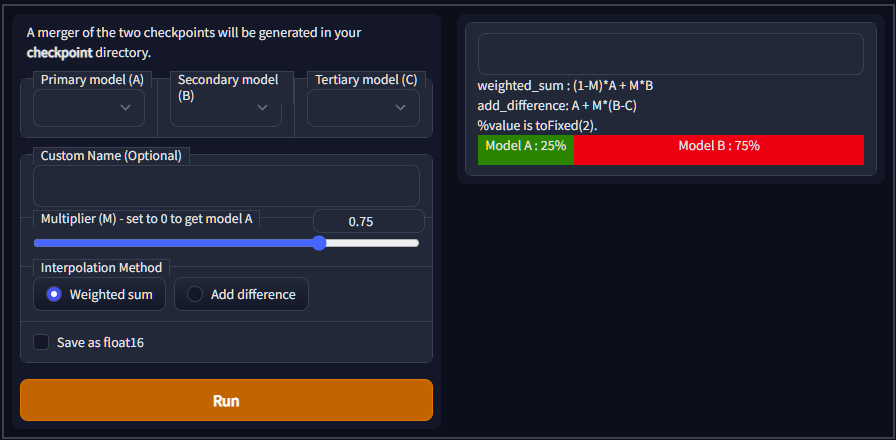

# Merge percentage visualize script

- this is script for [Stable Diffusion Web UI by AUTOMATIC1111](https://github.com/AUTOMATIC1111/stable-diffusion-webui).

## Features

- add Green and Red BOX for visualize Model A and Model B percentage.
- both Box size will change with "Multiplier" value changes.
